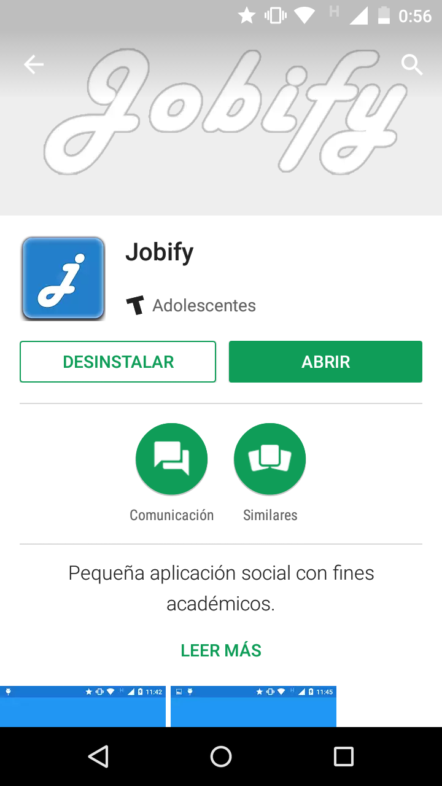

============================================================================================================
Instalación
============================================================================================================
Actualmente Jobify se encuentra disponible únicamente para dispósitivos móviles Android. 
Existen 2 formas de instalar la aplicación: a través de Google Play; o manualmente.

Instalación por Google Play
------------------------------------------------------------------------------------------------------------

* Ingresar a la aplicación google play en su dispositivo Android.

* Buscar la aplicación Jobify. Debería observar una imagen similar a la siguiente.

* Seleccione la opción instalar.

* Acepte los permisos necesarios y espere a que la descarga finalize.

* Cuando haya finalizado la descarga, la instalación comenzará en forma inmediata. Finalmente se creará un acceso directo a la aplicación en el dispotivo, el cual podrá usar para ingresar cuando desee.

Instalación Manual
------------------------------------------------------------------------------------------------------------
Si no encuentra la aplicación en Google Play, aún puede instalarla manualmente. Para eso, debe seguir los siguientes pasos:

* Copiar el archivo jobify-app-debug.apk al dispositivo donde se desea instalar.

* Seleccionar y abrir el archivo apk desde el dispositivo. y luego aceptar los permisos necesarios para su instalacion y funcionamiento.

* Aceptar los permisos necesarios para su instalacion y esperar a que la instalación finalice.

* Cuando haya finalizado la instalación se creará un acceso directo a la aplicación en el dispotivo, el cual podrá usar para ingresar cuando desee.

