============================================================================================================
Manual de Uso
============================================================================================================
El objetivo de este manual, es brindarle al usuario toda la información necesaria para que pueda usar la aplicación sin dificultades.

Pantalla de Inicio
=============================================================================================================
La pantalla inicial con la que se encontrará al abrir la aplicación, consiste principalmente de 2 botones: Sign Up y Log In.

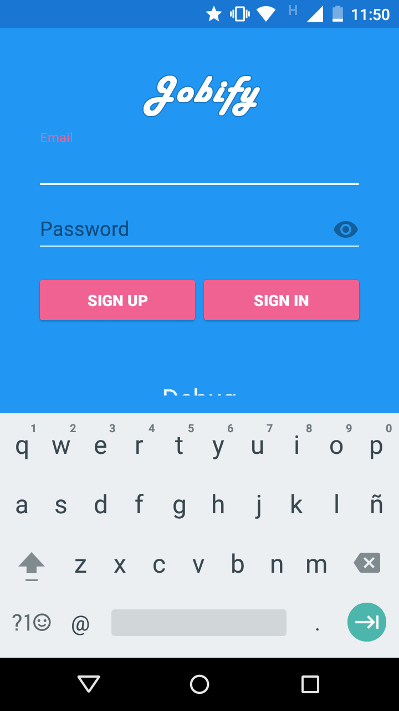

Sign Up
------------------------------------------------------------------------
Este botón, le permite ir a otra pantalla donde podrá crearse una nueva cuenta, para usar dentro de la aplicación. Para crearse una cuenta, simplemente debe llenar los datos del formulario y presionar el botón sign up, como se muestra en la imágen inferior. 
Recuerde que la dirección del mail debe ser una dirección válida y la utilizará cada vez que desee ingresar a la aplicación.

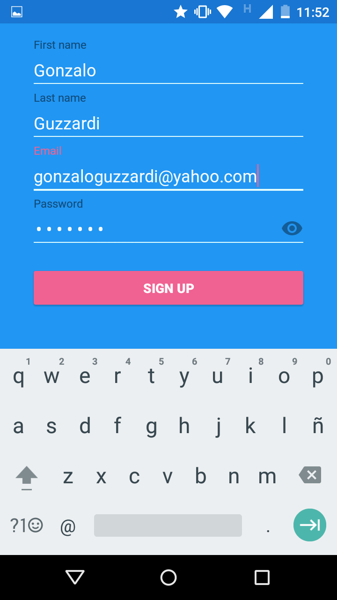

Si es su primera vez o no tiene cuenta, recuerde crear una antes de proseguir.

Si todo sale bien, se informará que la cuenta ha sido creada con éxito y regresará a la pantalla de login.

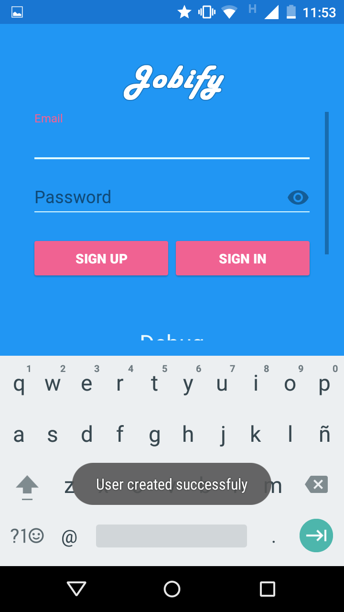

Log In
-------------------------------------------------------------------------
Una vez que posee una cuenta, puede ingresar el email y el password, y presionar el botón Log In, para ingresar a la aplicación.
Si el usuario no existe o la password es incorrecta, se informara por pantalla.
En caso contrario, accederá a la pantalla principal de la aplicación.

Pantalla Principal
================================================================================================================================
Felicitaciones, ha ingresado a la aplicación y ya puede disfrutar de sus beneficios.
La pantalla principal consiste en 4 pestañas: Perfil, Contactos, Notificaciones y Chat. Puede cambiar de una pestaña a la otra apretando el ícono de la pestaña que desee visualizar, o bien mediante un gesto de desplazamiento de dedo o swipe.

Como todavía es nuevo en la aplicación, se verá un tanto vacío hasta que no complete los datos de su perfi.

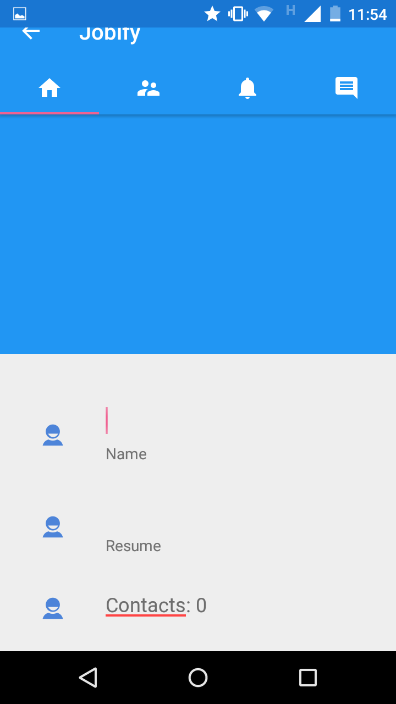

Pestaña de Perfil
================================================================================================================================
Esta pestaña es la que verá a penas ingrese a la aplicación, y le permite ver los datos de su perfil, como también modificarlos. Recuerde que estos datos estarán visible los demás usuarios de la aplicación.

Los datos de perfil que se pueden observar son: foto de perfil, nombre completo, resumen, email, cantidad de contactos, destrezas, experiencia laboral.

Cambiar Foto de Perfil
-------------------------------------------------------------------------
Para cambiar su foto de perfil, ingrese en la parte azul de la pantalla, por encima del campo Name. Si dispone de más de una aplicación para resolver la acción, se le preguntará con cual desea buscar la imagen a seleccionar.

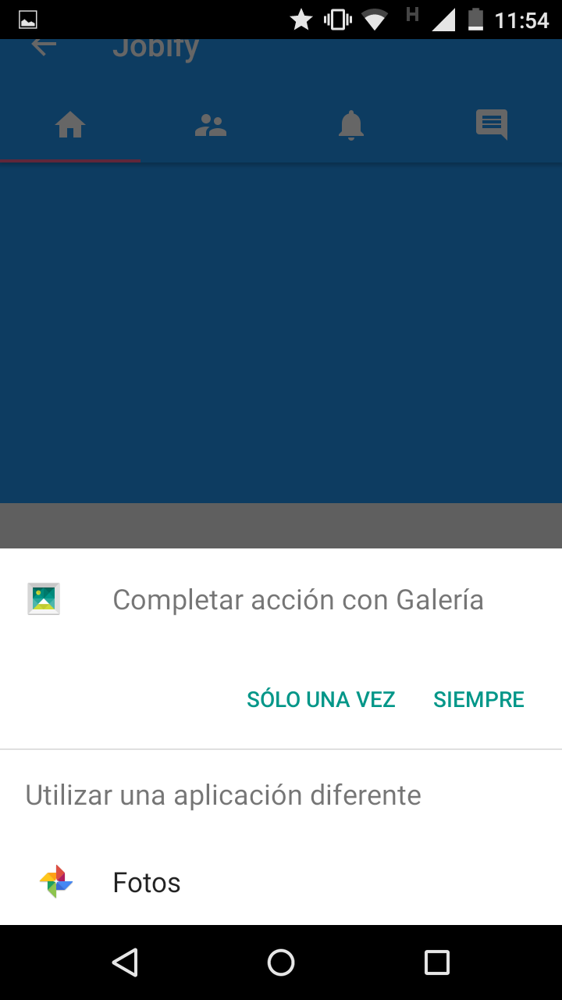

Una vez que haya seleccionado la imagen, se le informará si pudo ser cargada con éxitoy , de ser así, la misma ya se debería observar en su perfil.

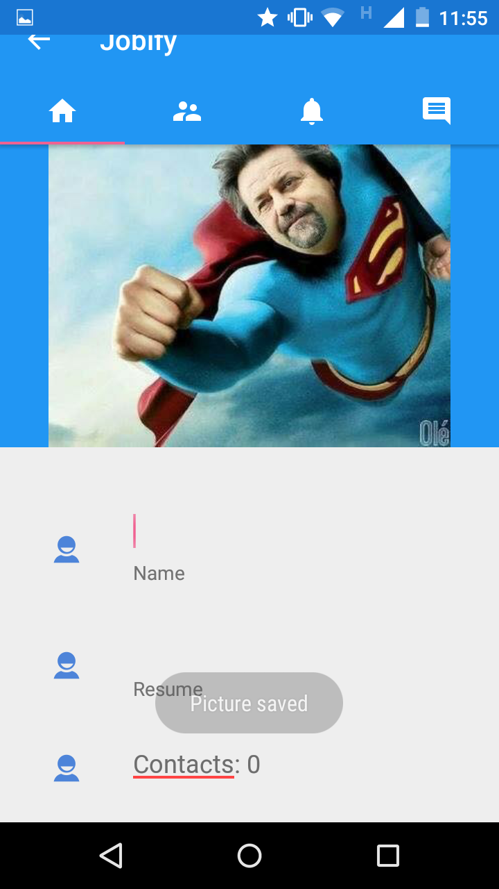

Cambiar Nombre y Resumen
----------------------------------------------------------------------------
Los campos de nombre y resumen, se modifican en forma directa desde la pestaña perfil. Para eso, solo debe cliquear en el campo, y editar el texto correspondiente.

.. figure:: screenshots/7-complete-profile-info.png
	:align: center
	:figclass: align-center
	:scale: 30%

Una vez que esta conforme con los datos ingresados, desplazese hacia la parte inferior del perfil, y presione el botón "Save Changes". Se informará que los cambios han sido guardado con éxito mediante un mensaje: "Changes Saved".

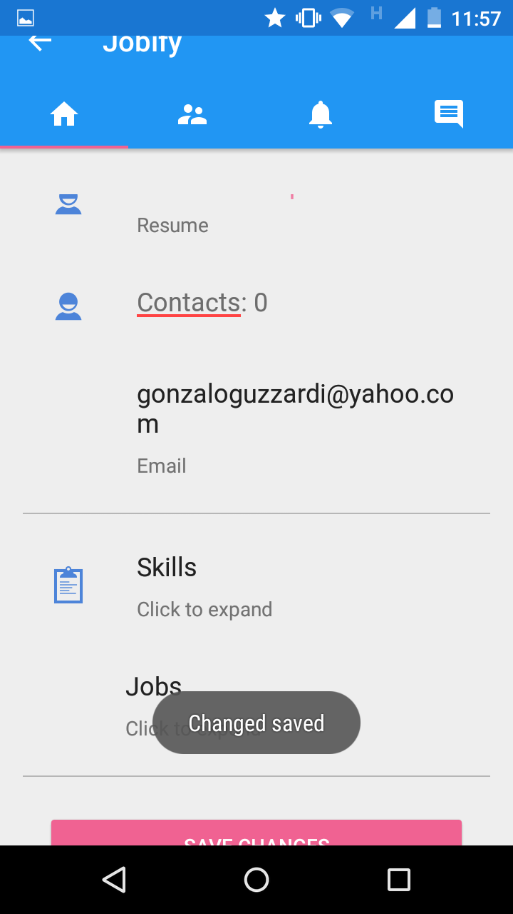

Destrezas
----------------------------------------------------------------------------
Para ver sus destrezas, debe hacer click en los campos "Skills". Si todavía no posee ninguna destreza o experiencia laboral, observará algo similar a lo siguiente:

Para agregar una nueva destreza, presione el botón "Add Skill". a continuación, se abrirá una nueva pantalla en donde deberá ingresar los datos correspondientes.

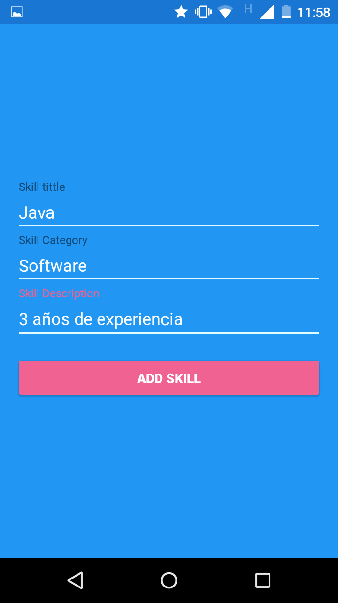

Una vez conforme con los datos ingresados, presione el botón "Add Skill" de la nueva pantalla y volverá a la pantalla de destrezas, donde podrá observar que se ha agregado la nueva, además de un mensaje "Skill Added".

.. figure:: screenshots/11-skill-added-msg.png
	:align: center
	:figclass: align-center
	:scale: 30%

Experiencia Laboral
----------------------------------------------------------------------------
Para ver su experiencia laboral, debe hacer click en los campos "Jobs". Si todavía no posee ninguna experiencia laboral, observará algo similar a lo siguiente:

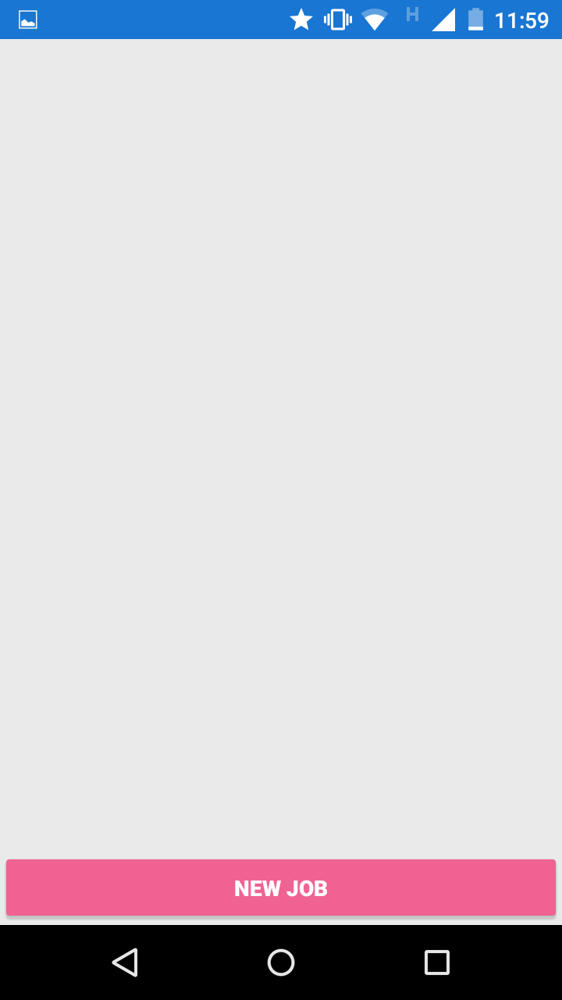

Para agregar una nueva experiencia laboral, presione el botón "Add Job". a continuación, se abrirá una nueva pantalla en donde deberá ingresar los datos correspondientes.

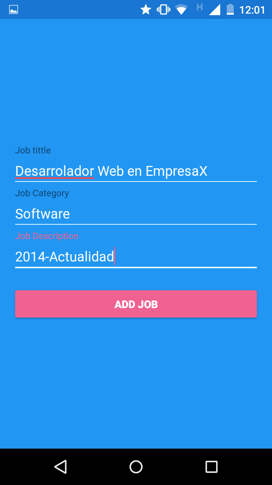

Una vez conforme con los datos ingresados, presione el botón "Add Job" de la nueva pantalla y volverá a la pantalla de experiencia laboral, donde podrá observar que se ha agregado la nueva, además de un mensaje "Job Added".

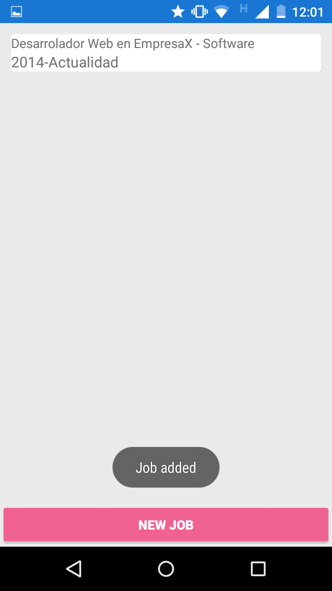

Pestaña de Contactos
================================================================================================================================
En esta pestaña puede observar a todos sus contactos actuales, como también buscar contactos nuevos.

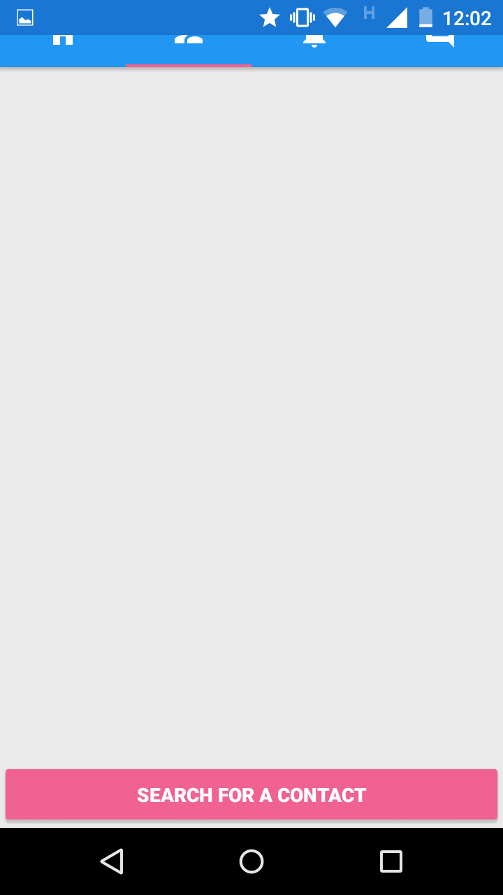

Buscar Contacto
----------------------------------------------------------------------------
Para buscar un contacto que desea agregar, presione en el botón "Search For a Contact". Se abrirá una nueva pantalla:

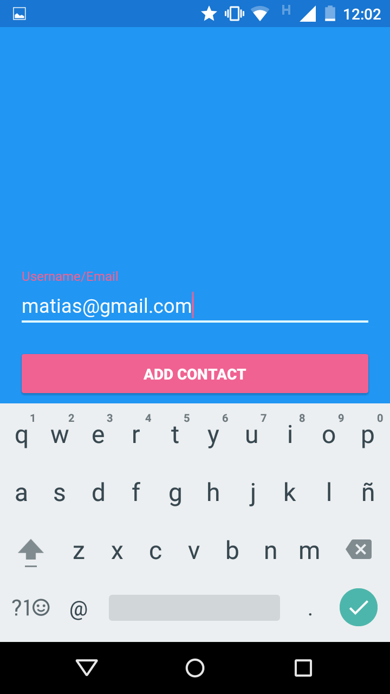

En esta pantalla, ingrese el email del contacto a agregar y luego presione el botón "Add Contact". Si todo ha salido bien, verá un mensaje "A notification has been sent" y se enviará una notificación al contacto con la solicitud para que sea aceptado.

Pestaña de Notificaciones
================================================================================================================================
En esta pestaña, puede encontrar todas las notificaciones que le han llegado. Estas pueden ser notificaciones sobre algún usuario que desea agregarlo a su lista de contactos, o notificaciones sobre nuevos mensajes de alguna conversación que mantiene con alguno de sus contactos.

Siguiendo con el ejemplo anterior, al contacto que quisimos agregar, le llegará una solicitud como se observa en la siguiente imagen:

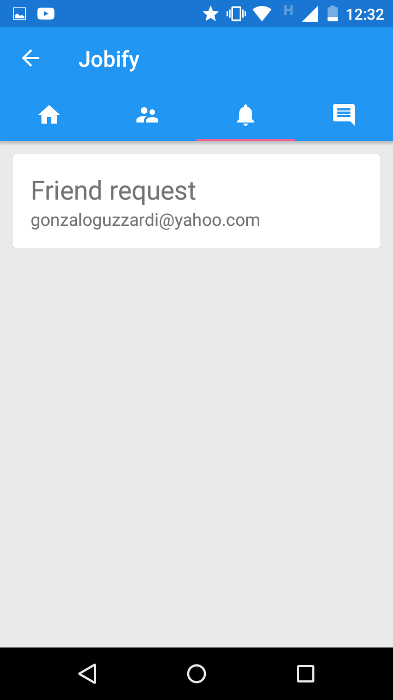

Aceptar Solicitud de Amistad
----------------------------------------------------------------------------
Si presiona en la notificación correspondiente a una solicitud de amistad (agregar a la lista de contactos), se le presentará un diálogo en donde podrá aceptar o no al contacto.

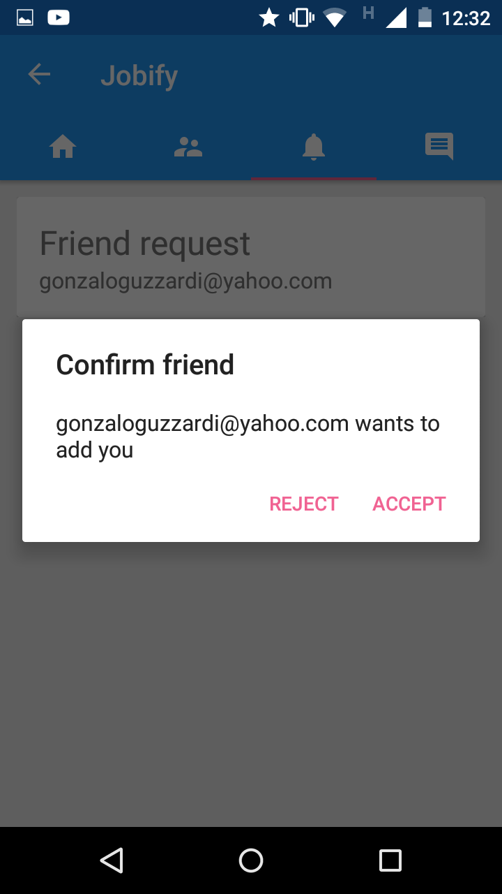

Al aceptar un contacto, se informará el éxito de la acción mediante un mensaje:

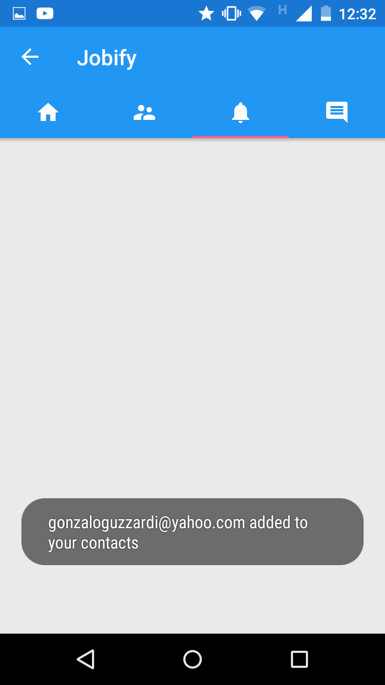

Si ahora se dirige a la pestaña de contactos, podrá observar que el contacto ahora se encuentra en su lista de contactos, y observará la foto de perfil y nombre del mismo.

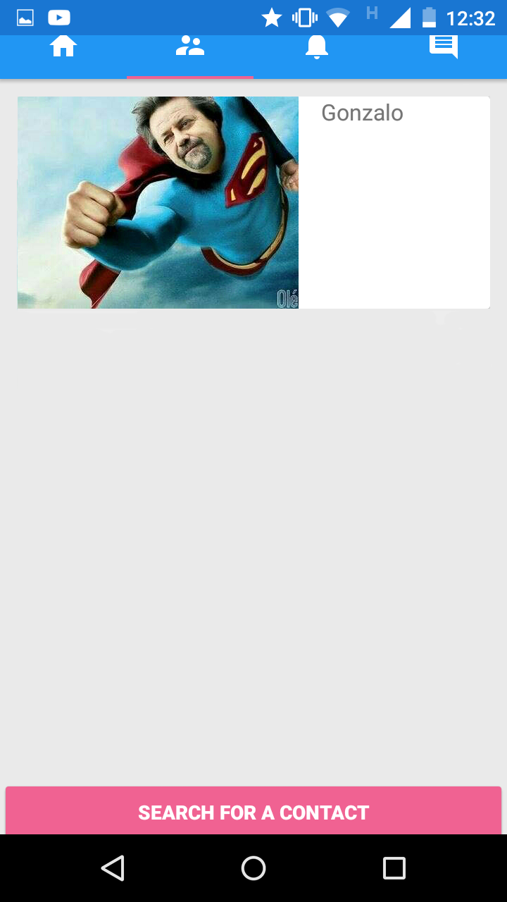

Pestaña de Chats
================================================================================================================================
En desarrollo. Todavía no ha sido integrada a la aplicación móvil.

